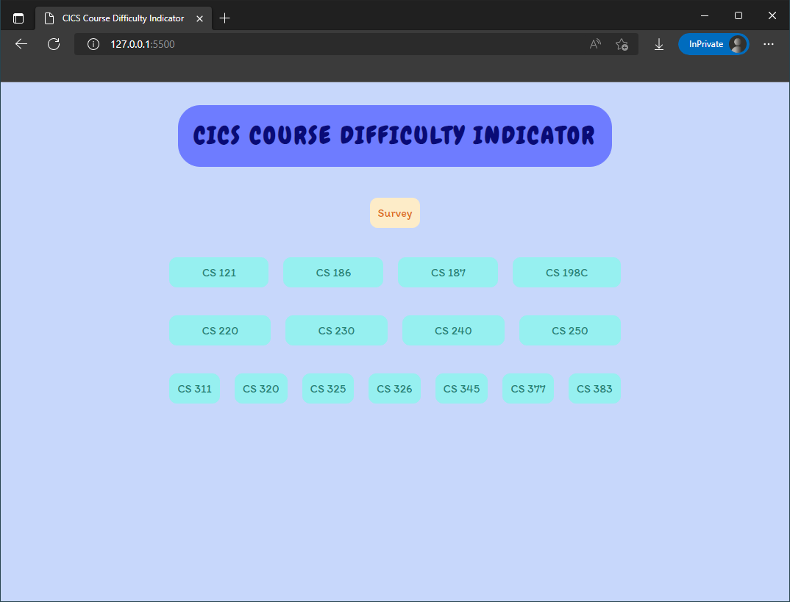
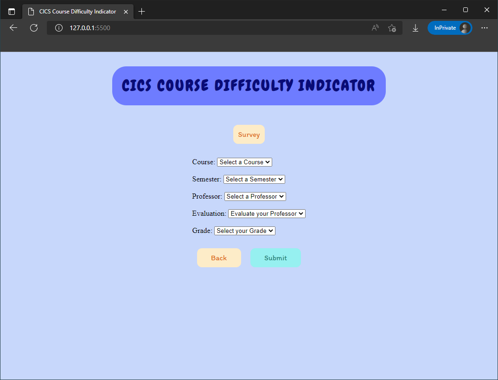
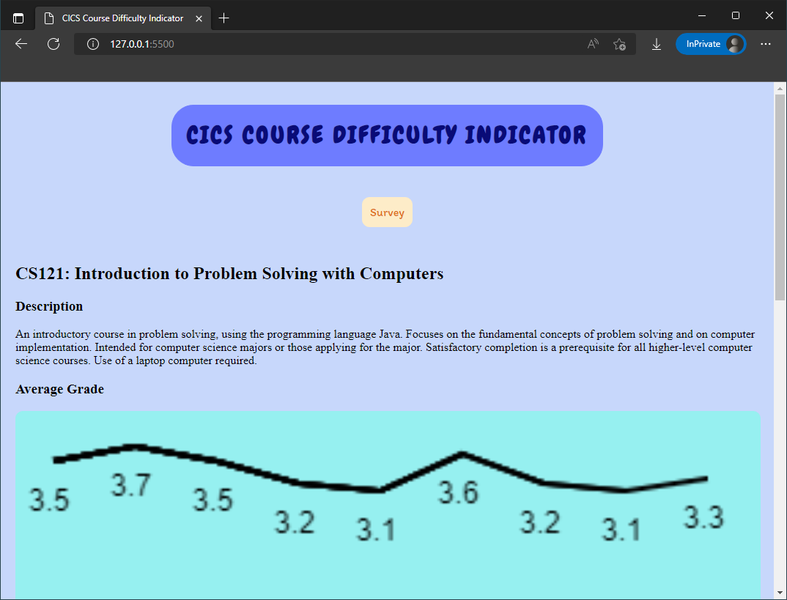

> Team Name: Soccer
>
> Application Name: CICS Course Difficulty Indicator

# Team Overview

- Cisco Song (GitHub: [ws-umass](https://github.com/ws-umass))

# Data Interaction

The user interface and data interaction have not changed significantly from the previous design ideas. The main data is collected via the `Survey` button at the top of the page. When the user clicks the `Survey` button, the main page will covered with gray, and the content of the survey will appear on the current page. The survey mainly includes the course title, the semester of the class, the professor, the user's evaluation of the professor, and the user's final letter grade. When the user clicks `Submit`, the entered content will be added to the corresponding database table.

Whenever the user clicks the corresponding course title on the main interface, first extract all the data of the course from the database, calculate the average grade through `AVG()` and take out `MIN()` and `MAX()`. Display the average grade through a line graph. In this way, users can clearly understand the average score trend of this course. By showing the highest and lowest scores, you can see how difficult the course is for all students. Similarly, the evaluation trend of professors can allow students to understand the changes in professor evaluations. The drop and rise of a professor's rating can also affect a student's choice of a course.

All records will be anonymous, so no student's name will be recorded in the database. As long as the user clicks on the corresponding course, all the data will be called from the database, so the data can be guaranteed to be updated in real time.

# HTML Page

The HTML page is divided into two main parts. At the top is a `Survey` button. Clicking this button will clear the entire page and fill the content of the survey into the page.

Note that this is not a brand new page, but the same HTML page as the previous page, and all UI changes are done through DOM manipulation. When we click the `Back` button or the `Submit` button, we can return to the main interface.

The second part is the button of each course, click the course button, the user can enter the description page of the course, and the user can quickly see the trend of the grade. Similarly, it is also done through the DOM. All the interfaces seen here are in the same HTML file.

